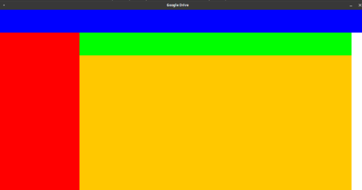

# Google Drive Panel

# Contenido
El proyecto cuenta con 2 clases:

    Control.java, clase con main
    Vista.java, creación y configuración de la ventana

# Ejecución del proyecto
Ejecutar la clase Control.java para la ejecución:

   

# Construido con:
El lenguaje Java
